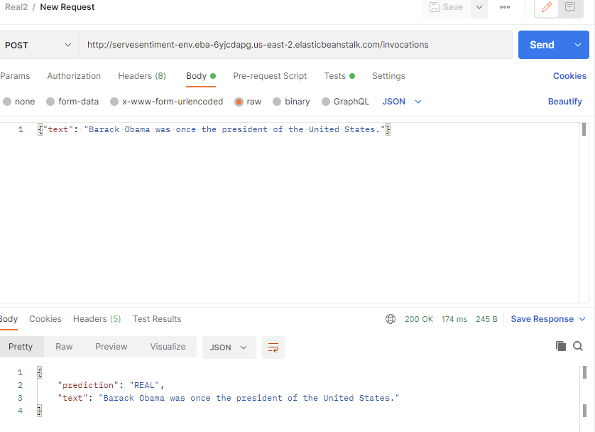
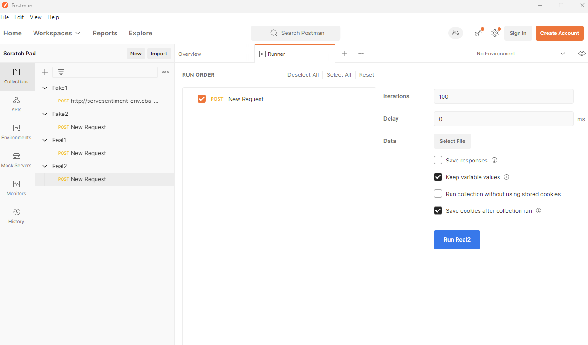
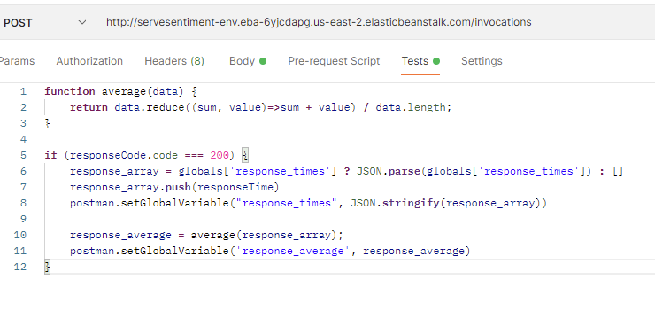
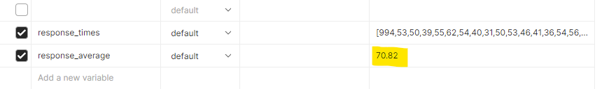

This lab was done using AWS Elastic Beanstalk and Postman for API testing.

Site can be found at (now closed): [http://servesentiment-env.eba-6yjcdapg.us-east-2.elasticbeanstalk.com/](http://servesentiment-env.eba-6yjcdapg.us-east-2.elasticbeanstalk.com/)

**Postman API Call Testing Screenshots**
Post request

Setup for 100 calls

Calculate average latency function

Results for one text input

